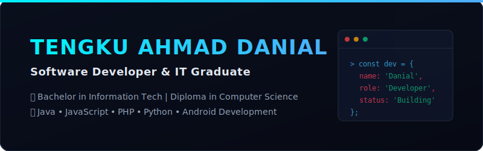

# Welcome to my GitHub Profile! ⚡

  

  
  

---

## ⚡ About Me

👋 Hello! I'm **Tengku Ahmad Danial**, an aspiring Software Developer and IT Graduate based in Malaysia. I hold a **Bachelor in Information Technology** and a **Diploma in Computer Science**. 

I am passionate about building responsive front-end applications, robust enterprise backend solutions, and practical mobile applications that solve real-world problems.

- 🎓 **Education:** Bachelor of IT & Diploma in Computer Science
- 💼 **Focus:** Full-stack Web Development & Mobile Applications
- 📍 **Location:** Malaysia (UTC+08:00)
- ⚙️ **Workflow:** Clean code, MVC patterns, and responsive layouts

---

## 🛠️ Tech Stack & Skills

<table align="center">
  <tr>
    <td valign="top" width="50%">
      <h3>🌐 Web Development</h3>
      
      
      
      
      
    </td>
    <td valign="top" width="50%">
      <h3>☕ Enterprise & Mobile</h3>
      
      
      
      
    </td>
  </tr>
  <tr>
    <td valign="top" width="50%">
      <h3>🗄️ Architecture & Tools</h3>
      
      
      
    </td>
    <td valign="top" width="50%">
      <h3>💻 Environments</h3>
      
      
      
    </td>
  </tr>
</table>

---

## 📂 Featured Projects

Here are some of the key projects I have built, showcasing a range of tech stacks:

### 🎫 [DIZA Event Tickets (Java Servlet & JSP)](https://github.com/KuDanial/DIZA-Event-Ticket-Servlet)
> **A fully completed ticket booking and event logistics management platform.**
- **Architecture:** Model-View-Controller (MVC) with Java Servlets, JSP pages, and Database integration.
- **Key Features:** User booking system, ticket validation, ticket status checking, and backend admin dashboard for organizers.
- **Tech Stack:** `Java`, `Jakarta Servlets`, `JSP`, `Tomcat`, `HTML5`, `CSS3`.

### 🚗 [Campus Ride Booking System - GrabWeb UiTM](https://github.com/KuDanial/Campus-Ride-Booking-System)
> **A web prototype developed for managing fixed-route campus shuttle rides.**
- **Key Features:** Shuttle routes tracking, user profiles, booking history dashboard, and administrative console.
- **Tech Stack:** `PHP`, `JavaScript`, `MySQL`, `HTML5`, `CSS3`, `Responsive Grid Layout`.

### 🪙 [zGold Danny Calculator (Android App)](https://github.com/KuDanial/zgold-danny-calculator)
> **Android app designed to accurately calculate gold Zakat payments based on standard Shariah rules in Malaysia.**
- **Key Features:** Visual calculation progress, gold type selection (keep vs. wear), and dynamic rate updates.
- **Tech Stack:** `Java`, `Android SDK`, `XML Layouts`, `Shariah Rules Computation`.

### 🎮 [NoxPass Subscription Platform (Front-end Web App)](https://github.com/KuDanial/noxpass-ecommerce-platform)
> **A high-fidelity responsive front-end dashboard for a digital PC game subscription service.**
- **Key Features:** Fluid animations, interactive games explorer, pricing/plan selectors, and interactive UI components.
- **Tech Stack:** `HTML5`, `CSS3 (Vanilla)`, `JavaScript (ES6+)`, `Flexbox/Grid`.

---

## 📈 GitHub Stats

  
  

  

---

## ✉️ Let's Connect!

I am always open to discussing new web development projects, collaborating on open-source repositories, or exploring career opportunities:

- **LinkedIn:** [linkedin.com/in/tengkuahmaddanial](https://www.linkedin.com/in/tengkuahmaddanial/)
- **Email:** tengkuahmaddanial420@gmail.com
- **Personal Web Projects Portfolio:** Check out my repository list above! 🚀

---

  ❤️ Thank you for visiting! ❤️

